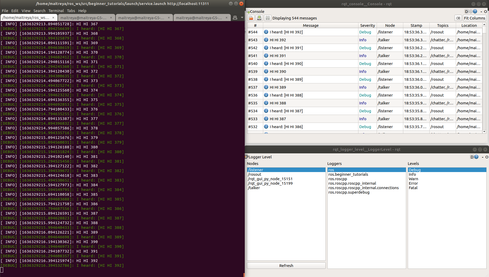
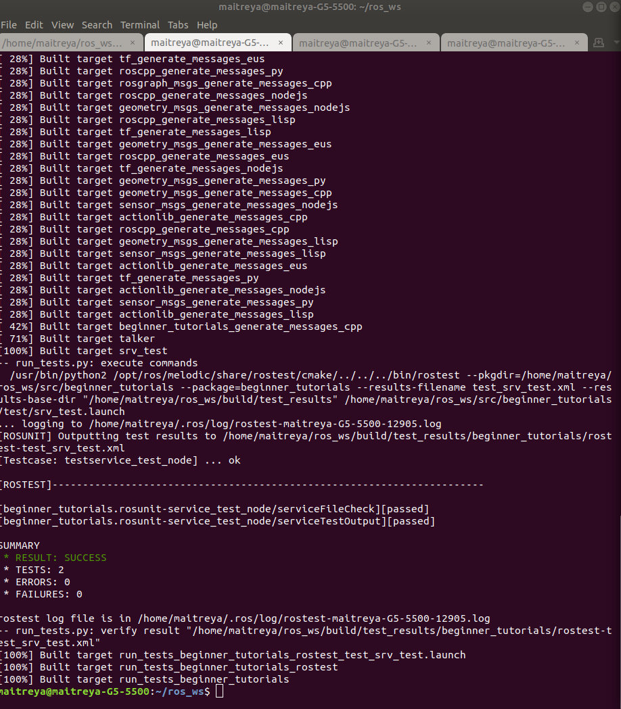

# First  ROS Service Package
[](https://opensource.org/licenses/MIT)

## Overview
This Respository consists of a ROS package for beginners for establishing a publisher and a subscriber node. The publisher publishes a string message onto the topic "chatter". The subscriber node subscribes to the corresponding topic. Service calls are made to the publisher to change the string the publisher publishes.

### Author
Maitreya Kulkarni

## Dependencies
The project depends on the following dependencies
* [](https://releases.ubuntu.com/18.04/)  


* [](http://wiki.ros.org/melodic/Installation/Ubuntu)

## Building Package
Terminal:1
```
    mkdir ~p /catkin_ws/src
    cd ~/catkin_ws/src
    mkdir ~/src
    cd ~/src
    git clone https://github.com/maitreya98/beginner_tutorials.git
    cd ~/catkin_ws
    catkin_make
    source devel/setup.bash
    roscore
```
## Running with launch file
1. Running launch file with frequency argument
```
cd /catkin_ws
source devel/setup.bash
roslaunch beginner_tutorials service.launch set_frequency:=<your_frequency_argument>
```
2. Running launch file without frequency argument 
```
cd /catkin_ws
source devel/setup.bash
roslaunch beginner_tutorials service.launch 
```
## Running with individual node
Open your workspace in new terminal

```
roscore
```
1. For running publisher node: (New Terminal)

```
source devel/setup.bash
rosrun beginner_tutorials talker
```

2. For running subscriber node (New Terminal)
```
source devel/setup.bash
rosrun beginner_tutorials listener
```

## Using Rosservice to change base string
```
source devel/setup.bash
rosservice call /NewService "input_msg: '<your_string>'"
```

## Visualize logging messages
1. In new terminal 
```
rosrun rqt_console rqt_console
```
2. In another terminal
```
rosrun rqt_logger_level rqt_logger_level
```
* Visualization Output


## Inspecting TF Data
```bash
cd ~/<your_ws>
    source devel/setup.bash
    rosrun rqt_tf_tree rqt_tf_tree
```
```bash
    cd ~/<your_ws>
    source devel/setup.bash
    rosrun tf tf_echo world talk 
```
## Inspecting ros bag file 
 ```bash
    cd ~/<your_ws>
    source devel/setup.bash
    rosbag info src/beginner_tutorials/results/my_bagfile.bag 
```
    Playing *my_bagfile.bag* ros bag file:
```bash
    cd ~/<your_ws>
    source devel/setup.bash
    rosbag play -l src/beginner_tutorials/results/my_bagfile.bag 
```

## Ruuning ROS Test
```bash
cd ~/<your_ws>
catkin_make
catkin_make run_tests_beginner_tutorials
```
* ROS Test


For cppcheck
```bash
sh run_cppcheck.sh
```
For cpplint
```
sh run_cpplint.sh 
`````

## License
MIT License
```
Copyright (c) 2021 Maitreya Kulkarni.
Permission is hereby granted, free of charge, to any person obtaining a copy of this software and associated documentation files (the "Software"), to deal in the Software without restriction, including without limitation the rights to use, copy, modify, merge, publish, distribute, sublicense, and/or sell copies of the Software, and to permit persons to whom the Software is furnished to do so, subject to the following conditions:
The above copyright notice and this permission notice shall be included in all copies or substantial portions of the Software.
THE SOFTWARE IS PROVIDED "AS IS", WITHOUT WARRANTY OF ANY KIND, EXPRESS OR IMPLIED, INCLUDING BUT NOT LIMITED TO THE WARRANTIES OF MERCHANTABILITY, FITNESS FOR A PARTICULAR PURPOSE AND NONINFRINGEMENT. IN NO EVENT SHALL THE AUTHORS OR COPYRIGHT HOLDERS BE LIABLE FOR ANY CLAIM, DAMAGES OR OTHER LIABILITY, WHETHER IN AN ACTION OF CONTRACT, TORT OR OTHERWISE, ARISING FROM, OUT OF OR IN CONNECTION WITH THE SOFTWARE OR THE USE OR OTHER DEALINGS IN THE SOFTWARE.
```


